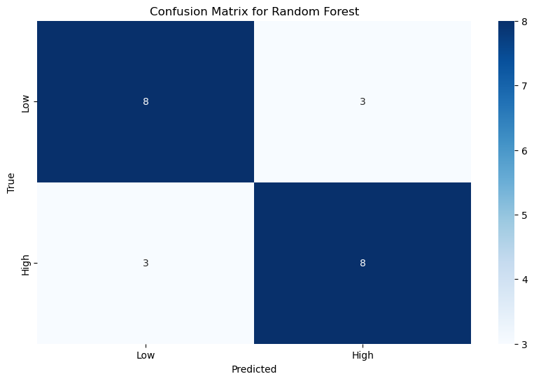
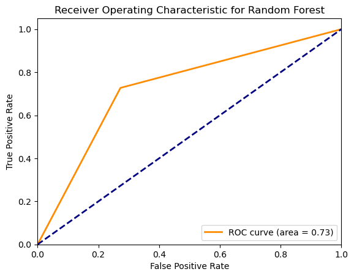
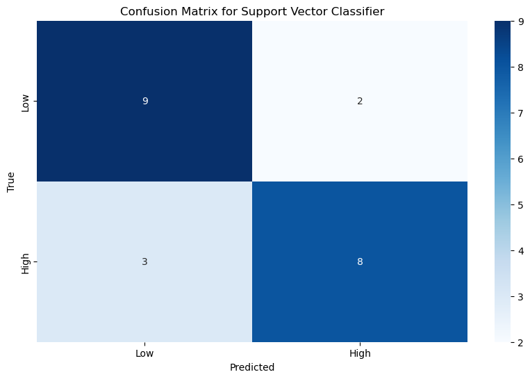
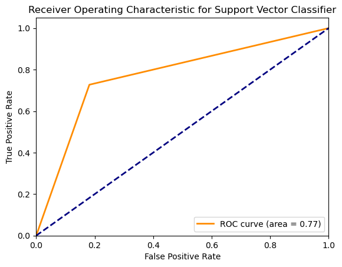
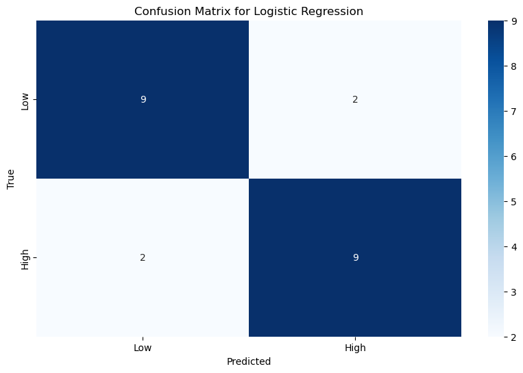
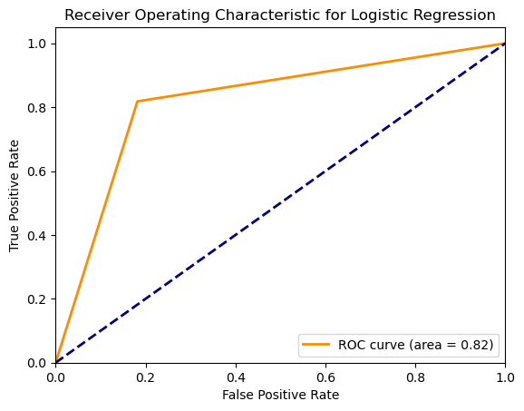
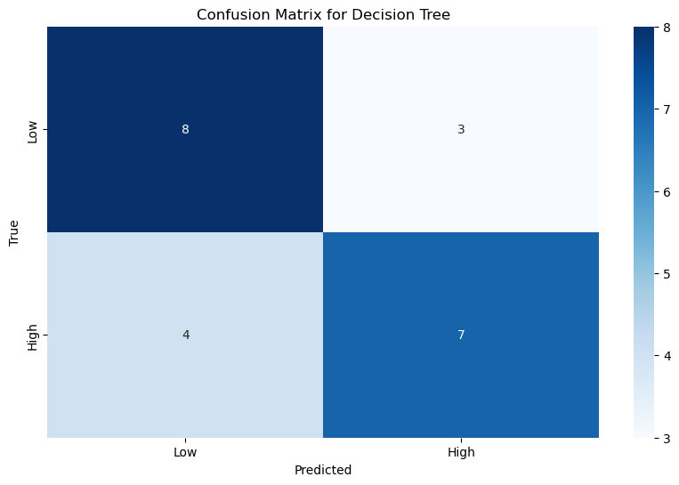
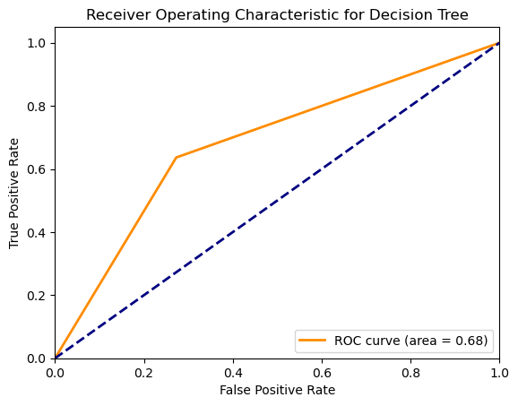

The following is a report detailing working with a small dataset. For the report regarding real data/bigger datasets, see *reportRealData.md*.

#### Overview

The aim of this project is to develop an intelligent algorithm to classify and predict immune responses to influenza vaccination, specifically identifying high and low responders based on various features from blood tests. We are utilizing several machine learning models, including Random Forest Classifier, Support Vector Classifier, Logistic Regression, and Decision Tree. The workflow involves data preprocessing, model training, hyperparameter optimization using Grid Search, and evaluation of model performance.

#### Data Preprocessing

**Purpose:**

-   To clean and prepare the data for model training and evaluation.
-   Handle missing values, convert categorical variables to numerical, and normalize features.

**Steps:**

1.  **Loading Data:** We load the dataset from an Excel or CSV file.
    
    ```
    def load_data(file_path):
        # Load the dataset from a specified CSV or Excel file.
	```
    
2.  **Handling Missing Values:** We drop columns with missing values to ensure clean data for model training.
    ```
    def preprocess_data(data):
        # Drop columns with missing values.
        data.dropna(axis=1, inplace=True)
    ```
    
3.  **Converting Categorical Variables:** Convert categorical columns to numerical using one-hot encoding.
    ```
    data = pd.get_dummies(data, columns=['type'], drop_first=True)
    ```
    
4.  **Feature and Target Separation:** Separate the features (X) from the target variable (y).
    
    ```
    X = data.drop(columns=['Donor ID', 'outcome'])
    y = data['outcome'].map({'low': 0, 'high': 1})
    ``` 
    
5.  **Normalization:** Normalize the feature values for better model performance.
    ```
    from sklearn.preprocessing import StandardScaler
    scaler = StandardScaler()
    X = scaler.fit_transform(X)
    ``` 
    

#### Model Training and Validation

**Purpose:**

-   To train various machine learning models and evaluate their performance using cross-validation.

**Steps:**

0. **Handling Class Imbalance with SMOTE and/or ADASYN**: 
    ```
	from imblearn.over_sampling import SMOTE
	from imblearn.over_sampling import ADASYN

	X, y = SMOTE(random_state=1337).fit_resample(X, y)
	# alternatively, use ADASYN instead of SMOTE
	# X, y = ADASYN(random_state=1337).fit_resample(X, y)
    ```

1.  **Splitting Data:** Split the data into training and testing sets.
    
    ```
    from sklearn.model_selection import train_test_split
    X_train, X_test, y_train, y_test = train_test_split(X, y, test_size=0.3, random_state=42)
    ``` 
    
2.  **Defining Models:** Define the machine learning models to be used.
    ```
    models = {
        "Random Forest": RandomForestClassifier(random_state=42),
        "Support Vector Classifier": SVC(random_state=42),
        "Logistic Regression": LogisticRegression(random_state=42),
        "Decision Tree": DecisionTreeClassifier(random_state=42)
    }
    ```
    
3.  **Cross-Validation:** Perform cross-validation to assess the performance of each model.
    ```
    from sklearn.model_selection import cross_val_score
    cv_scores = cross_val_score(model, X, y, cv=5)
    ``` 
    

#### Hyperparameter Optimization

**Purpose:**

-   To optimize the hyperparameters of the models using Grid Search for better performance.

**Steps:**

1.  **Defining Hyperparameters Grid:** Define the grid of hyperparameters for each model.
    ```
    param_grid_rf = {
        'n_estimators': [50, 100, 200],
        'max_features': ['auto', 'sqrt', 'log2'],
        'max_depth': [None, 10, 20, 30]
    }
    ``` 
    
2.  **Grid Search:** Perform Grid Search to find the best hyperparameters.
    ```
    from sklearn.model_selection import GridSearchCV
    grid_search = GridSearchCV(estimator=model, param_grid=param_grid, cv=5, scoring='accuracy')
    grid_search.fit(X_train, y_train)
    ```
    

#### Model Evaluation

**Purpose:**

-   To evaluate the performance of the trained models on the test set using various metrics.

**Steps:**

1.  **Predictions:** Make predictions on the test set.
    ```
    y_pred = model.predict(X_test)
    ``` 
    
2.  **Metrics Calculation:** Calculate and display performance metrics like accuracy, classification report, confusion matrix, and ROC-AUC score.
    
    ```
    from sklearn.metrics import accuracy_score, classification_report, confusion_matrix, roc_auc_score
    accuracy = accuracy_score(y_test, y_pred)
    classification_report = classification_report(y_test, y_pred)
    confusion_matrix = confusion_matrix(y_test, y_pred)
    roc_auc = roc_auc_score(y_test, y_pred)
    ```


#### Models and Their Functionality
1.  **Random Forest Classifier:**
    
    -   **Description:**
        -   Random Forest is an ensemble learning method that constructs multiple decision trees during training. It uses the principle of bagging (Bootstrap Aggregating) where each tree is trained on a random subset of the data with replacement.
        -   Each tree in the forest is constructed independently using a random subset of features, which helps in reducing correlation among trees and improves the generalization ability of the model.
        -   The output class is determined by majority vote of the individual trees, making it robust to overfitting.
    -   **Advantages:**
        -   Handles large datasets with higher dimensionality.
        -   Effective at estimating missing data.
        -   Provides feature importance, which helps in understanding the influence of each feature on the prediction.
        -   Robust against overfitting due to averaging multiple decision trees.
    -   **Hyperparameters:**
        -   `n_estimators`: Number of trees in the forest. More trees generally improve the performance but at the cost of increased computational time.
        -   `max_depth`: Maximum depth of each tree. Controls the complexity of the model.
        -   `min_samples_split`: Minimum number of samples required to split an internal node. Helps to prevent overfitting.
        -   `min_samples_leaf`: Minimum number of samples required to be at a leaf node. Helps in smoothing the model.
        -   `max_features`: Number of features to consider when looking for the best split.
2.  **Support Vector Classifier (SVC):**
    
    -   **Description:**
        -   SVC is a supervised learning model that aims to find the optimal hyperplane that best separates the data into classes. It works well for both linear and non-linear classification by using kernel trick.
        -   The algorithm maximizes the margin between the data points of the two classes, which is the distance between the hyperplane and the closest points from either class.
        -   Kernel functions can be used to transform the input features into higher-dimensional space, making it possible to handle non-linear separations.
    -   **Advantages:**
        -   Effective in high-dimensional spaces and with a large number of features.
        -   Robust to overfitting, especially in high-dimensional space.
        -   Can handle non-linear relationships using kernel functions.
    -   **Hyperparameters:**
        -   `C`: Regularization parameter that controls the trade-off between achieving a low error on the training data and minimizing the norm of the coefficients.
        -   `kernel`: Specifies the kernel type to be used in the algorithm (e.g., linear, poly, rbf, sigmoid).
        -   `gamma`: Kernel coefficient for ‘rbf’, ‘poly’, and ‘sigmoid’. Defines how far the influence of a single training example reaches.
        -   `degree`: Degree of the polynomial kernel function (‘poly’). Ignored by other kernels.
3.  **Logistic Regression:**
    
    -   **Description:**
        -   Logistic Regression is a linear model for binary classification that models the probability of the outcome as a function of the input features. It uses the logistic function to squeeze the output of a linear equation between 0 and 1.
        -   The model estimates the parameters of the logistic function by maximizing the likelihood of the observed data.
        -   The decision boundary is a hyperplane that separates the two classes.
    -   **Advantages:**
        -   Simple and interpretable.
        -   Provides probability estimates, which can be useful in decision-making processes.
        -   Works well when the relationship between the independent and dependent variables is approximately linear.
        -   Can be regularized to prevent overfitting.
    -   **Hyperparameters:**
        -   `C`: Inverse of regularization strength. Smaller values specify stronger regularization.
        -   `solver`: Algorithm to use in the optimization problem (e.g., liblinear, newton-cg, lbfgs, sag, saga).
        -   `penalty`: Norm used in the penalization (e.g., l1, l2).
4.  **Decision Tree Classifier:**
    
    -   **Description:**
        -   Decision Trees split the data into subsets based on the value of input features. The splits are made in a way that increases the homogeneity of the resultant subsets.
        -   The tree is constructed by recursively partitioning the data until all leaf nodes are pure or contain fewer than the minimum number of samples required to split.
        -   Decision nodes represent decisions and leaf nodes represent outcomes.
    -   **Advantages:**
        -   Easy to interpret and visualize.
        -   Requires little data preprocessing (no need for normalization or dummy variables).
        -   Can capture non-linear relationships.
    -   **Hyperparameters:**
        -   `max_depth`: Maximum depth of the tree. Limits the number of splits and prevents overfitting.
        -   `min_samples_split`: Minimum number of samples required to split an internal node.
        -   `min_samples_leaf`: Minimum number of samples required to be at a leaf node.
        -   `max_features`: Number of features to consider when looking for the best split.
        -   `criterion`: Function to measure the quality of a split (e.g., gini, entropy).

#### Data Preparation

1.  **Loading the Dataset:**
    
    -   Data is loaded from a CSV or Excel file using pandas.
    -   All columns are initially loaded as strings to prevent automatic type conversion that may misrepresent the data.
2.  **Handling Missing Values:**
    
    -   Columns with missing values are dropped for simplicity. Imputation methods are used.
3.  **Feature Engineering:**
    
    -   Categorical features (e.g., gender) are converted into numerical representations using one-hot encoding.
    -   The outcome variable ('low' or 'high') is mapped to binary values (0 or 1).
4.  **Normalization:**
    
    -   Features are normalized using one of many Scalers (one is chosen) to ensure that each feature contributes equally to the model performance.
5.  **Balancing the Dataset:**
    
    -   Imbalanced datasets can lead to biased models. ***SMOTE*** (Synthetic Minority Over-sampling Technique) and/or ***ADASYN*** (Adaptive Synthetic Sampling) are used to generate synthetic samples for the minority class, ensuring a balanced dataset.

#### Model Training and Evaluation

1.  **Cross-Validation:**
    
    -   5-fold stratified cross-validation is used to validate each model. This ensures that the performance metrics are reliable and the model generalizes well to unseen data.
    -   Stratified cross-validation ensures that each fold has the same proportion of class labels as the original dataset, preventing bias in the training and validation process.
2.  **Hyperparameter Tuning:**
    
    -   Grid Search is used to identify the best hyperparameters for each model, optimizing for performance metrics like accuracy, precision, recall, and F1-score.
    -   Grid Search systematically works through multiple combinations of parameter tunes, cross-validating as it goes to determine which tune gives the best performance.
3.  **Training on the Full Training Set:**
    
    -   Once the best parameters are identified, models are trained on the entire training set to leverage all available data for training.
    -   This helps to improve the model's performance by utilizing more data.
4.  **Model Evaluation:**
    
    -   Models are evaluated on a separate test set to assess their performance. Key metrics include accuracy, precision, recall, F1-score, and ROC-AUC.
    -   Confusion matrices are generated to visualize the performance of each model in terms of true positives, true negatives, false positives, and false negatives.
5.  **Handling Class Imbalance in Evaluation:**
    
    -   Class weights are adjusted to handle imbalance in the training data.
    -   Evaluation metrics focus on both classes to ensure that the model performs well across the entire dataset.










